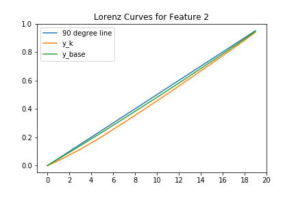

## Installation
this package can be installed from [PyPI](https://pypi.org/project/shapley-lz/) using the following command

```
pip install shapley_lz
```

N.B.
- there is also a [multiprocessing version](Code/shapley_lz_multiproc), using Python's inbuilt multiprocessing module, thus making use of all cpu cores, allowing faster runtime within the Code folder linked above.
- xgboost is not yet supported

## Summary

The module computes Shapley-Lorenz contribution coefficients, as defined in the paper "Shapley-Lorenz decompositions in eXplainable Artificial Intelligence", by Paolo Giudici and Emanuela Raffinetti from February 2020.

The function takes as input
* the pre-trained model `f(·)`,
* a sample of the training covariance matrix `X_train` and
* a covariance test set, `X_test`, whose output, `f(X_test)`, is to be explained

and returns an array of Lorenz Zonoid value for each feature, computed using the Shapley attribution mechanism, in order to account for interaction effects.

## Exmaple Using a Random Forest Classifier With Simulated Data
```Python
import numpy as np
from sklearn.ensemble import RandomForestClassifier as rf_class
from sklearn.datasets import make_classifaction as gen_data
from shapley_lz import ShapleyLorenzShare

# Simple example w/o train-test splitting thus same covariance matrix used and only first 100 observations explained
# Generate data
N = 1000 # number of observations
p = 4 # number of features
X, y = gen_data(n_samples = N, n_features = 4, n_informative = 4, n_redundant = 0)

# Train model
model = rf_class()
model.fit(X,y)

# Compute Shapley Lorenz Zonoid shares
slz = ShapleyLorenzShare(model.predict_proba, X, y)
slz_values = slz.shapleyLorenz_val(X, y, class_prob = True, pred_out = 'predict_proba')

# Plot
# (Bar chart automatically plots in increasing order of SLZ value)
slz.slz_plots(slz_values[0])
```


## Example Using Multiple Processors With MLP on California Housing Data
```Python
# N.B. please use the multiprocessing version of the shapley_lz module in the code folder. This has not yet been deployed in the PyPi package.
from sklearn.datasets import fetch_california_housing as data
from sklearn.neural_network import MLPRegressor as mlp
import multiprocessing as mp
from functools import partial
from time import time

# Get data
X,y = data(return_X_y=True, as_frame=True)

# Train model
model = mlp()
model.fit(X,y)

# Multiprocessing setup
slz = ShapleyLorenzShare(model.predict, X[:50], y[:50])
iterator = np.arange(X.shape[1])
def slz_parallel_func(iterator):
    pool = mp.Pool(mp.cpu_count())
    slz_fnc = partial(slz.shapleyLorenz_val, X = X, y = y)
    result_list = pool.map(slz_fnc, iterator)
    print(result_list)

# Compute SLZ values
start = time()
if __name__ == '__main__':
    slz_parallel_func(iterator)
print(f'Time elapsed: {time() - start}')
```

## Intuition

Plot of Lorenz Curves for simulation data set with three features and normally distributed features and error term:



How to read:
The diagonal 90-degree line represents a model that has no input features and forms its prediction as the average over all outcomes. Thus, the furter away the Lorenz curve for a prediction model with p features is from the 90 degree line, the more of the variation in the observed response variable, the model is able to explain.

By a Lemma as mentioned in the aforementioned paper, the Lorenz Zonoid of a model with p-1 features is always smaller (in terms of surface area, calculated by the difference between the Lorenz Curve and its inverse), than the Lorenz Zonoid of a model with p features. This is exemplified in the graph, where it can be seen, that the set of points between the 90-degree line and the Lorenz curve for the prediction model excluding feature k is a subset of the points between the 90-degree Line and the Lorenz curve of the prediction model including feature k.
